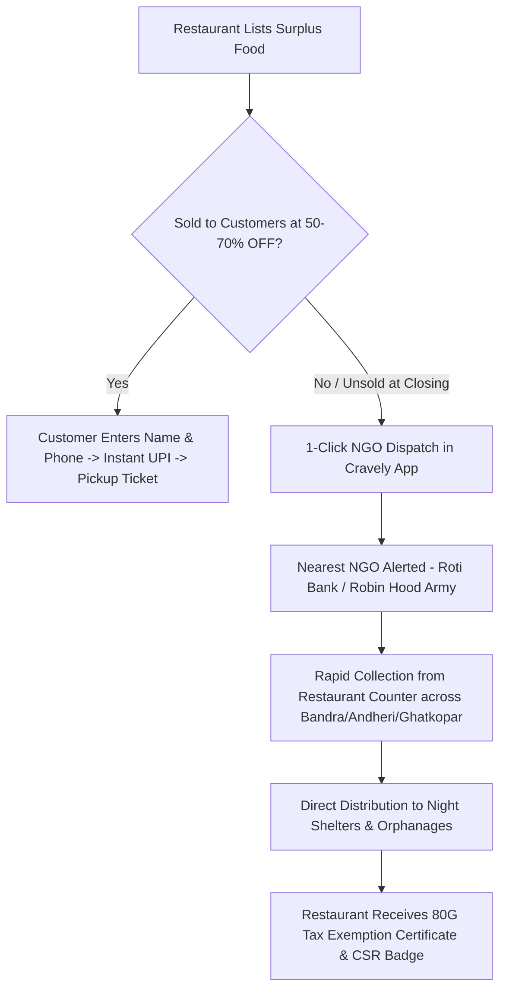

# 🍽️ Cravely — Crave More. Waste Less.

> **Surplus Food Rescue & NGO Redistribution Platform** — Connecting people with surplus restaurant food at **50% to 70% OFF** across **Bandra, Andheri, Ghatkopar, Grant Road & Vasai**, backed by a 1-click **100% Zero-Waste NGO Dispatch Network** for any unsold food.


---

## 🌟 Key Features

### 1. 🤫 AI "Mystery Box" / Surprise Box Generator
- **Smart Surplus Bundling**: Instead of restaurants having to list every single random leftover item individually, Cravely AI dynamically bundles available kitchen inventory into high-value Surprise Boxes at **60% to 70% OFF**.
- **Dynamic Configuration**:
  - **Location Awareness**: Tailored to Bandra, Andheri, Ghatkopar, Grant Road & Vasai.
  - **Dietary Preferences**: 🌱 Pure Veg Box, 🍗 Non-Veg Feast, 🍰 Sweet & Bakery Box, 🥪 Street Food & Munchies.
  - **Tiered Box Sizes**:
    - 🎒 **Mini Box**: ₹129 *(Orig. ₹340 • 2 Surplus Items)*
    - 🎁 **Surprise Box**: ₹199 *(Orig. ₹480 • 3–4 Surplus Items)*
    - 👑 **Deluxe Feast**: ₹299 *(Orig. ₹750 • 4–5 Premium Items + Beverage)*
- **Interactive Peek & Reveal**: Toggle between "Peek Inside (AI Breakdown)" to inspect portions or keep it sealed as a thrilling surprise!

### 2. 👤 "My Cravely" Member Hub & User Dashboard
- **👤 Profile Management**: Customize foodie avatar (🥑, 🍕, 🥗, 🍜, 🍰, 👑), full name, SMS/OTP phone number, email, neighborhood locality (Bandra, Andheri, Ghatkopar, Grant Road, Vasai), and dietary tags (Pure Veg, Non-Veg, Vegan, Jain, Eggetarian).
- **🛍️ My Orders History**: Complete log of all past food rescues with prices paid, money saved, receipt slips, and 1-click reorder matching.
- **❤️ Saved Meals & Wishlist**: Bookmark favorite surplus flash deals with instant 1-tap heart toggles (`cravely_saved_meals`) across the app and reserve directly from your saved list.
- **🤖 My AI Preferences**: Fine-tune cuisine cravings, spice tolerance slider (Mild 🌿, Medium 🌶️, Fiery 🔥), max budget ceiling, and toggle adaptive machine learning.
- **🌱 Personal Eco-Impact**: Real-time calculated counters for Meals Rescued, ₹ Saved, Kg CO₂ Emissions Prevented, and Litres of Water Conserved. Features environmental milestone badges and a generative shareable Eco-Impact Certificate.
- **🎟️ Active Pickup Codes & Live Passes**: Live counter passes featuring high-visibility pickup codes (`CRV-XXXX`), simulated animated QR laser scanner, 4-digit counter OTP, live ticking collection timer, Google Maps directions, and 1-click "Mark as Collected" completion.

### 3. ✨ AI Personalized Recommendations ("Cravely AI Taste Match")
- **Adaptive Machine Learning Engine**: Analyzes user's previous meal saves, dietary profile, and neighborhood spending habits from local storage.
- **Dynamic Confidence Scoring**: Displays high-accuracy match badges (e.g. `🤖 98% Taste Match`, `🔥 High Value Pick`).
- **Interactive Taste Tuning**: Users can click real-time craving chips (Biryani & Curries, Street Snacks, Desserts, South Indian, Pizza, Budget <₹100) to instantly regenerate matched surplus deals.
- **Continuous Learning**: Automatically learns from every completed reservation.

### 4. 📍 Curated Locations & Flash Drops
- Real-time surplus listings from top eateries across major hubs:
  - **Bandra** (Hill Road, Pali Hill, Bandra Station)
  - **Andheri** (Lokhandwala, JB Nagar, Metro line)
  - **Ghatkopar** (Khau Galli, Tilak Road)
  - **Grant Road** (Station area, Girgaon, SoBo)
  - **Vasai** (Station Road, coastal eateries)
- **Dynamic Countdown Timers** showing real-time pickup windows for each live deal.
- **Dietary & Category Filters**: Filter by Pure Veg 🌱, Non-Veg 🍗, Desserts & Bakery 🍰, and Street Food & Combos 🥪.

### 5. ⚡ Instant Reservation with Customer Details & UPI Checkout
- **Customer Verification & Basic Info**: Prompts user for their **Full Name**, **Mobile Number** (for SMS / OTP pickup verification), **Email**, and optional **Pickup Notes**.
- **Smart Auto-Fill**: Remembers customer info in `localStorage` for 1-tap subsequent meal rescues.
- **Flexible Pickup Windows**: Immediate (Next 30 mins), Evening (8–9 PM), Late Night (10–11:15 PM).
- **Simulated Instant UPI Payment**: Google Pay, PhonePe, Paytm, and Pay-at-Counter.
- **Customized Pickup Ticket**: Generates instant unique pickup code (`CRV-XXXX`) linked with customer name, phone, and area.

### 6. 🤝 100% Zero-Waste NGO Redistribution Network
- **End-of-Day Surplus Connect**: If prepared food is still remaining at restaurants after discounted customer windows close, restaurants can request a volunteer pickup in 1 click.
- **Verified NGO Partnerships**: Integrated with **Roti Bank, Robin Hood Army, Feeding India, Akshaya Patra**, and local night shelters.
- **Instant Dispatch Tracker**: Generates live volunteer assignment tickets (`NGO-XXXX`) with volunteer ETA and location routing.
- **80G Tax Exemption & CSR Certificates**: Generates digital receipts for restaurants eligible for tax benefits and corporate social responsibility (CSR) compliance.
- **NGO Recipient Onboarding**: Dedicated registration flow for registered charities and shelter homes.

### 7. 🌍 Eco-Impact & Annual Money Savings Calculator
- Interactive weekly rescue slider tailored for dining averages:
  - 💰 **Annual ₹ Saved** (₹20,280/yr default for 3 meals/week)
  - 🌿 **Kg CO₂ Emissions Prevented**
  - 💧 **Litres of Water Conserved**
  - 🍽️ **Total Meals Rescued & Donated**

### 8. 🏪 Restaurant Partner Portal & Revenue Estimator
- Dedicated partner onboarding modal with ROI calculator (Est. ₹42,000–₹85,000 extra monthly revenue).
- Zero listing fees with customizable takeaway and donation slots.

### 9. 🎨 Modern Glassmorphic UI & Micro-interactions
- Responsive glassmorphic aesthetic with dark mode toggle & `localStorage` persistence.
- Animated floating canvas particles and live impact stats ticker.
- Toast notification system and floating back-to-top button.

---

## 🔄 How the NGO Surplus Redistribution Works



---

## 🚀 Quick Start & Local Preview

No heavy frameworks or dependencies needed! Cravely is built with lightweight vanilla modern web standards.

### Option 1: Open Directly in Browser
Simply double-click `index.html` or `cravely.html` to open it in your browser.

### Option 2: Live Server (VS Code / Python / Node)
Using Python:
```bash
python -m http.server 3000
```
Then visit `http://localhost:3000` in your web browser.

---

## 📁 Project Structure

```
cravely/
├── index.html        # Main web app & GitHub Pages entry
├── cravely.html      # Cravely single-page application
└── README.md         # Project documentation & overview
```

---

## 🛠️ Built With

- **HTML5 & Semantic Markup**
- **Modern CSS3**: Glassmorphism, CSS Custom Properties, Flexbox & CSS Grid, Animations
- **Vanilla JavaScript (ES6+)**: Intersection Observer, Event Delegation, LocalStorage, Canvas API
- **Font Awesome 6 & Google Fonts (Poppins)**
- **Canvas Confetti** for reservation and NGO donation celebrations

---

## 🤝 Contributing

Contributions are always welcome! Feel free to open an issue or submit a pull request:

1. Fork the Project
2. Create your Feature Branch (`git checkout -b feature/AmazingFeature`)
3. Commit your Changes (`git commit -m 'Add some AmazingFeature'`)
4. Push to the Branch (`git push origin feature/AmazingFeature`)
5. Open a Pull Request

---

## 📄 License

Distributed under the MIT License. See `LICENSE` for more information.