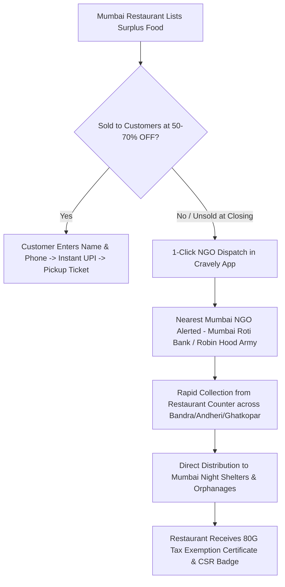

# 🍽️ Cravely Mumbai — Crave More. Waste Less.

> **Mumbai's #1 Surplus Food Rescue & NGO Redistribution Platform** — Connecting Mumbaikars with surplus restaurant food at **50% to 70% OFF** across **Bandra, Andheri, Ghatkopar, Grant Road & Vasai**, backed by a 1-click **100% Zero-Waste Mumbai NGO Dispatch Network** for any unsold food.


---

## 🌟 Key Features

### 1. 📍 Exclusively Mumbai Locations & Flash Drops
- Real-time surplus listings from top eateries across major Mumbai hubs:
  - **Bandra West & East** (Hill Road, Pali Hill, Bandra Station)
  - **Andheri West & East** (Lokhandwala, JB Nagar, Metro line)
  - **Ghatkopar East & West** (Khau Galli, Tilak Road)
  - **Grant Road & South Mumbai** (Station area, Girgaon, SoBo)
  - **Vasai - Virar MMR** (Station Road, coastal eateries)
- **Dynamic Countdown Timers** showing real-time pickup windows for each Mumbai deal.
- **Dietary & Category Filters**: Filter by Pure Veg 🌱, Non-Veg 🍗, Desserts & Bakery 🍰, and Street Food & Combos 🥪.

### 2. ⚡ Instant Reservation with Customer Details & UPI Checkout
- **Customer Verification**: Prompts user for their **Full Name**, **Mobile Number** (for SMS / OTP pickup verification), **Email**, and optional **Pickup Notes**.
- **Smart Auto-Fill**: Remembers customer info in `localStorage` for 1-tap subsequent meal rescues.
- **Flexible Pickup Windows**: Immediate (Next 30 mins), Evening (8–9 PM), Late Night (10–11:15 PM).
- **Simulated Instant UPI Payment**: Google Pay, PhonePe, Paytm, and Pay-at-Counter.
- **Customized Pickup Ticket**: Generates instant unique pickup code (`MUM-XXXX`) linked with customer name, phone, and area.

### 3. 🤝 100% Zero-Waste Mumbai NGO Redistribution Network
- **End-of-Day Surplus Connect**: If prepared food is still remaining at restaurants after discounted customer windows close, restaurants can request a volunteer pickup in 1 click.
- **Verified Mumbai NGO Partnerships**: Integrated with **Mumbai Roti Bank, Robin Hood Army (Mumbai Chapters), Feeding India Mumbai, Akshaya Patra Mumbai**, and local night shelters.
- **Instant Dispatch Tracker**: Generates live volunteer assignment tickets (`MUM-NGO-XXXX`) with volunteer ETA and location routing.
- **80G Tax Exemption & CSR Certificates**: Generates digital receipts for Mumbai restaurants eligible for tax benefits and corporate social responsibility (CSR) compliance.
- **NGO Recipient Onboarding**: Dedicated registration flow for registered charities and shelter homes across Mumbai MMR.

### 4. 🌍 Eco-Impact & Annual Money Savings Calculator
- Interactive weekly rescue slider tailored for Mumbai dining averages:
  - 💰 **Annual ₹ Saved** (₹20,280/yr default for 3 meals/week)
  - 🌿 **Kg CO₂ Emissions Prevented**
  - 💧 **Litres of Water Conserved**
  - 🍽️ **Total Mumbai Meals Rescued & Donated**

### 5. 🏪 Mumbai Restaurant Partner Portal & Revenue Estimator
- Dedicated partner onboarding modal with ROI calculator (Est. ₹42,000–₹85,000 extra monthly revenue).
- Zero listing fees with customizable takeaway and donation slots.

### 6. 🎨 Modern Glassmorphic UI & Micro-interactions
- Responsive glassmorphic aesthetic with dark mode toggle & `localStorage` persistence.
- Animated floating canvas particles and live impact stats ticker.
- Toast notification system and floating back-to-top button.

---

## 🔄 How the Mumbai NGO Surplus Redistribution Works



---

## 🚀 Quick Start & Local Preview

No heavy frameworks or dependencies needed! Cravely is built with lightweight vanilla modern web standards.

### Option 1: Open Directly in Browser
Simply double-click `index.html` or `cravely.html` to open it in your browser.

### Option 2: Live Server (VS Code / Python / Node)
Using Python:
```bash
python -m http.server 3000
```
Then visit `http://localhost:3000` in your web browser.

---

## 📁 Project Structure

```
cravely/
├── index.html        # Main web app & GitHub Pages entry (Mumbai edition)
├── cravely.html      # Cravely single-page application
└── README.md         # Project documentation & overview
```

---

## 🛠️ Built With

- **HTML5 & Semantic Markup**
- **Modern CSS3**: Glassmorphism, CSS Custom Properties, Flexbox & CSS Grid, Animations
- **Vanilla JavaScript (ES6+)**: Intersection Observer, Event Delegation, LocalStorage, Canvas API
- **Font Awesome 6 & Google Fonts (Poppins)**
- **Canvas Confetti** for reservation and NGO donation celebrations

---

## 🤝 Contributing

Contributions are always welcome! Feel free to open an issue or submit a pull request:

1. Fork the Project
2. Create your Feature Branch (`git checkout -b feature/AmazingFeature`)
3. Commit your Changes (`git commit -m 'Add some AmazingFeature'`)
4. Push to the Branch (`git push origin feature/AmazingFeature`)
5. Open a Pull Request

---

## 📄 License

Distributed under the MIT License. See `LICENSE` for more information.